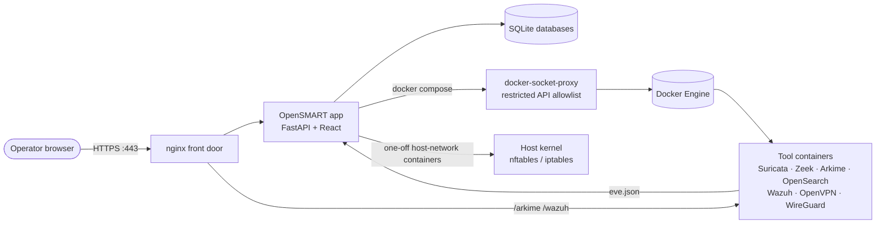
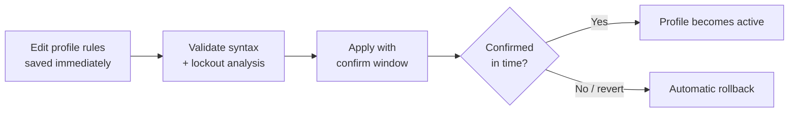
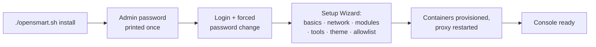

# OpenSMART v0.3

OpenSMART is an open-source security operations framework. It unifies network monitoring, intrusion detection, endpoint and vulnerability tooling, VPN access and host firewall management behind a single web console, deploying and orchestrating the underlying tools as containers.

## Origin of the Name

**SMART** comes from *Sensor de Monitoreo, Análisis y Recolección de Tráfico* (Traffic Monitoring, Analysis and Collection Sensor), a closed-source project developed at UNAM-CERT between 2008 and 2015. OpenSMART is its spiritual successor and natural evolution: an open-source, centralized framework that makes it easy to install and use multiple network security monitoring tools together. It shares ideas with other security monitoring frameworks, but focuses on simple deployment and a single, unified console.

> **Active development:** OpenSMART is under active development. Expect many features to be improved and adjusted within a short period of time, and some behavior to change between releases.

## Highlights

- **One console, many tools** — Suricata, Zeek, Arkime, OpenSearch, Wazuh, OpenVPN and WireGuard provisioned and monitored from one UI.
- **Guided first run** — a setup Wizard configures branding, capture interfaces, modules, tools and management-access allowlists.
- **Safe host firewall** — nftables and iptables engines with profiles, import/export, lockout analysis and commit-confirm apply (auto-revert unless confirmed).
- **Hardened by design** — Argon2 passwords, CSRF-protected sessions, login lockout, audit trail, and a restricted Docker socket proxy.
- **Single front door** — an nginx reverse proxy with HTTPS serves the console and embeds tool UIs from one origin.

## Architecture



The application container never mounts `docker.sock`; it talks to Docker through a proxy that only allows container, network, image and volume operations. The app itself is published on loopback only — nginx is the sole externally reachable entry point.

## Modules and Tools

| Module | Purpose | Backing components |
|---|---|---|
| Network IDS | Alert ingestion, triage, attack map, notifications | Suricata |
| Network Traffic Monitoring | Protocol and flow visibility | Suricata, Zeek |
| Access VPN | Create and manage VPN instances and users | OpenVPN, WireGuard |
| Firewall | Host firewall profiles and rules | nftables, iptables |
| Threat Detection Alerts, Endpoint, Vulnerability Management | Detection, endpoint and vulnerability views | Wazuh |
| Honeypot, LXC Manager | Placeholders for future releases | — |

| Tool | Role |
|---|---|
| Arkime | Full packet capture and session search |
| Wazuh | Endpoint security and SIEM |
| OpenSearch | Search and analytics backend |
| Proxmox, OPNsense, Graylog, ntop | External tools linked or embedded by URL |

## Firewall at a Glance



- Multiple **profiles**, each bound to one engine (nftables or iptables); any profile can be inspected and edited without applying it.
- **Management rules** for SSH and the web console are highlighted, cannot be disabled, and are edited as allowed networks.
- Import and export of existing rulesets, reusable aliases, and a firewall log view in the Audit page.

## First-Run Flow



## Quick Start

Requirements: a Debian or Ubuntu Linux host with root access. The installer sets up Docker Engine if missing.

```bash
./opensmart.sh install                 # build and start OpenSMART in a container
./opensmart.sh install --bind 0.0.0.0:443   # optionally choose the proxy bind address
```

Open `https://<host>/` (self-signed certificate by default) and sign in as `admin` with the generated password printed at the end of installation. You will be asked to change it on first login and then guided through the Wizard.

### Command reference

| Command | Description |
|---|---|
| `install` / `uninstall` | Install or fully remove OpenSMART and its containers |
| `start` / `stop` / `restart` | Control the OpenSMART container and front-door proxy |
| `recreate` | Rebuild the image from current source and recreate the container |
| `status` / `health` | Show container state and run integrity checks |
| `reset-admin-password` | Generate a new admin password (printed once) |
| `reset-data-ids` / `reset-data-network` / `reset-data-all` / `reset-all` | Reset telemetry or application data |

Run `./opensmart.sh --help` for all options.

## Security Model

| Area | Practice |
|---|---|
| Authentication | Local users, Argon2 hashes, forced first-login password change, configurable password policy |
| Sessions | HTTP-only cookie plus CSRF token on mutating requests |
| Abuse protection | Failed-login lockout by username and client IP |
| Authorization | Server-side role checks (admin / read-only) on every route |
| Auditing | Security-relevant actions recorded in an audit log |
| Containers | Docker socket proxy with a narrow allowlist; app published on loopback only |
| Firewall | Commit-confirm apply, lockout analysis, validated rule fields |
| Secrets | Generated at install time; none stored in source |

See [docs/security.md](docs/security.md) for details and known limitations.

## Technology Stack

| Layer | Technology |
|---|---|
| Backend | Python 3.13, FastAPI, SQLite, Argon2 (`uv` for dependencies) |
| Frontend | React, TypeScript, Vite |
| Operations | Bash installer, Docker Compose, nginx |
| Sensors | Suricata, Zeek, Arkime, OpenSearch, Wazuh |
| Access | OpenVPN, WireGuard |

## Repository Layout

```text
.
├── opensmart.sh          # installer / lifecycle CLI
├── opensmart/
│   ├── backend/          # FastAPI app, routes, shell hooks
│   ├── frontend/         # React + TypeScript console
│   ├── scripts/          # run and development helpers
│   └── containers/run/   # per-tool compose projects (nginx, wazuh, suricata, ...)
├── containers/
│   ├── build/            # Dockerfiles used by the installer
│   └── OpenSMART-Standalone/  # standalone sensor-stack reference bundle
├── docs/                 # documentation
└── logs/                 # runtime logs
```

## Development

```bash
uv sync --project opensmart/backend --python 3.13
./opensmart/scripts/dev_backend.sh        # backend on :8000
cd opensmart/frontend && npm install && npm run dev   # frontend on :5173
```

Basic checks: `bash -n opensmart.sh opensmart/scripts/*.sh`, `npm run build` in `opensmart/frontend`, and a backend import/compile check. See [docs/development.md](docs/development.md).

## Documentation

| Document | Content |
|---|---|
| [docs/architecture.md](docs/architecture.md) | System structure and runtime flow |
| [docs/technical-overview.md](docs/technical-overview.md) | Concise technical overview |
| [docs/user-guide.md](docs/user-guide.md) | Using the console |
| [docs/modules-reference.md](docs/modules-reference.md) | Module and tool reference |
| [docs/configuration.md](docs/configuration.md) | Environment and runtime settings |
| [docs/api.md](docs/api.md) | Backend API reference |
| [docs/security.md](docs/security.md) | Security behavior and limitations |
| [docs/development.md](docs/development.md) | Local development workflow |

## Status

OpenSMART v0.3 (beta). Honeypot and LXC Manager are placeholders, and automated test coverage is limited to syntax, import and build checks.

## Development Approach

OpenSMART follows a hybrid development approach that combines traditional software engineering with AI-assisted techniques. Maintainers review every change, and development applies secure, structured practices for agentic coding: scoped changes, security review of sensitive code paths, least-privilege tooling, and no secrets in source.

## License

Licensed under the [Apache License 2.0](LICENSE).
