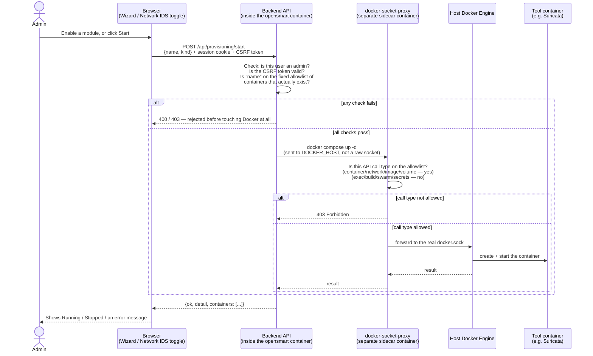

# Technical Overview — How OpenSMART Works

This is the "read this first" technical summary: what the app is made of, how a request flows through it, and — in more depth, since it's the newest and least obvious piece — how container provisioning works and what stops it from being a security hole. For exhaustive detail, see `docs/architecture.md` (full reference), `docs/modules-reference.md` (per-module/tool detail), `docs/api.md` (endpoint reference), `docs/security.md` (security reference), and `docs/MANIFEST.json` (machine-readable). For a non-developer explanation of the same material, see `docs/user-guide.md`.

## The Stack, in One Paragraph

A FastAPI (Python) backend with a SQLite database, a React/TypeScript frontend built with Vite, and a handful of Bash operational hooks. In development, the frontend runs on its own dev server (port 5173) and proxies API calls to the backend (port 8000). In production, the backend serves the built frontend itself on one port. Everything lives under `opensmart/` in the repo, started either directly on a host or inside a Docker container via `./opensmart.sh`.

## Request Flow

1. Browser loads the React app.
2. Every API call carries a session cookie (`opensmart_session`, HTTP-only) established at login.
3. Every *mutating* API call also carries a CSRF token (`X-CSRF-Token` header, matched against the `opensmart_csrf` cookie / session value) — read-only `GET`s don't need it.
4. Admin-only endpoints additionally check the session's role.
5. SQLite holds users, sessions, settings, module/tool catalogs, and audit events.

## Login → First Use, Step by Step

This is the sequence a brand-new install actually goes through, and it's worth spelling out because three separate mechanisms gate what a fresh admin can do, in order:

1. **Login** with the password printed at first boot.
2. **Forced password change.** That password was *set for* the admin, not chosen by them, so `mustChangePassword` is true. The server blocks every mutating endpoint except "change my password" and "log out" (`423 Locked`) until they pick a new one that satisfies the active complexity policy (`strict` by default). This isn't just a UI gate — hitting the API directly hits the same block.
3. **First-Run Wizard.** Once the password is changed, if this is a genuinely fresh install (no prior admin existed), the frontend redirects into a 5-step wizard: acknowledge the running version, optionally upload a logo, enable OpenSMART modules, enable Tools, then Finish — which attempts to provision containers for whatever got enabled and reports what happened per item. Existing/upgraded installs never see this (the flag defaults to already-done).
4. **Normal use.** Same login flow applies to every subsequent user, but steps 2–3 only fire when their specific conditions are true (a fresh password, or an incomplete install) — most logins skip straight to the app.

See `docs/security.md` for the exact enforcement mechanism and `docs/modules-reference.md`/`docs/configuration.md` for what each Wizard step configures.

## Container Provisioning

Some OpenSMART modules and tools are backed by real infrastructure — Suricata for the Network IDS module, Zeek for Network Traffic Monitoring, Arkime (plus its OpenSearch dependency) as a tool, WireGuard/OpenVPN for Access VPN. Enabling one of these in the UI (via the Wizard or a module's own config page) needs *something* to actually start that infrastructure. That "something" is the backend itself — but the backend runs inside its own container, and giving a container unrestricted control over the host's Docker daemon is close to giving it root on the host. The rest of this section is how that risk is bounded.

### The flow

### The security boundary, explained

The core idea: **the app container never touches `docker.sock` directly.** Instead:

- A separate sidecar container, `docker-socket-proxy`, is the *only* thing that mounts the real Docker socket (and it's mounted read-only into that one container).
- The proxy sits on the same internal Docker network as the app and exposes a filtered HTTP API. The app is told to use it via `DOCKER_HOST=tcp://docker-socket-proxy:2375` — from the app's point of view, it's just talking to "Docker," but every request actually passes through the filter first.
- The filter is an **allowlist**, not a blocklist: `CONTAINERS`, `NETWORKS`, `IMAGES`, `VOLUMES`, and `POST` (needed for `docker compose up`/`down` to work at all) are on. Everything else — `EXEC` (no shelling into other running containers), `BUILD`, `SWARM`, `SECRETS`, `SERVICES`, `SYSTEM`, `AUTH`, and more — is off. A request for any of those gets a `403` from the proxy before it ever reaches the real socket.
- On top of that, the backend itself never accepts an arbitrary container name from a request. `app/provisioning.py` keeps a fixed list of container directories that actually exist under `opensmart/containers/run/`, and rejects anything else with a `400` before it even constructs a `docker compose` command.
- Every start/stop is admin-only, requires the CSRF token like any other mutating action, and is written to the audit log (`provisioning_start`/`provisioning_stop`), visible on the Audit page.

**What this design protects against:** a bug or vulnerability in the backend's own code being escalated into full host compromise via Docker. Even in the worst case — a request-smuggling or injection bug in the provisioning route itself — the attacker is still limited to the proxy's allowlist: they could start/stop/list containers or pull images, but they cannot execute code inside other containers, build new images, touch Swarm state, or reach anything the proxy doesn't expose.

**What it doesn't protect against** (documented honestly in `docs/security.md`, not glossed over): the allowlist is still broader than a single "start/stop exactly these containers" permission would be — `POST` on `CONTAINERS`/`IMAGES`/`NETWORKS`/`VOLUMES` is real Docker Engine access, just a narrow slice of it. And provisioning calls aren't currently serialized per-container, so concurrent overlapping requests are an untested edge case.

### Why the containers themselves live where they do

`opensmart/containers/run/` (one `docker-compose.yml` per tool — Suricata, Zeek, Arkime, OpenSearch, WireGuard, OpenVPN, plus the main app) lives *inside* `opensmart/`, not at the repo root. This matters for a subtle reason: when `docker compose` runs *inside* the app container but talks to the *host's* Docker daemon (through the proxy), it resolves each tool's bind-mount paths (e.g. `./volumes/data`) based on where *it* sees the compose file — but the *host* daemon is the one that actually creates the mount, against *its own* filesystem. Those only match if the app container's view of `opensmart/` is mounted at the exact same absolute path as it has on the host. That's arranged via `OPENSMART_PROJECT_DIR` (computed by `opensmart.sh` from wherever the repo actually lives, never a fixed path like `/opt/opensmart`) rather than assuming a fixed install location.

## Modules, Tools, and What's Actually Live

Not everything in the UI is fully wired up yet — see `docs/modules-reference.md` for the honest per-item status. Network IDS and Network Traffic Monitoring have real ingestion/analysis behind them; several other modules are placeholder pages; Wazuh and Graylog have no container template yet at all, so enabling them reports "no template available" rather than pretending to work.
