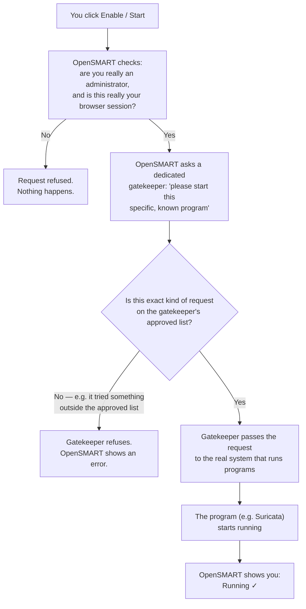

# OpenSMART User Guide (Non-Technical)

This guide explains what OpenSMART does and how to use it, without assuming a software or networking background. If you want the developer-level detail, see `docs/technical-overview.md` (how it works) and `docs/modules-reference.md` (every module and tool in detail).

## What Is OpenSMART?

OpenSMART is a dashboard that brings several security tools together in one place: intrusion detection, network traffic visibility, a firewall link, endpoint monitoring, and more. Instead of logging into five different systems, you log into OpenSMART once and reach all of them from one sidebar.

Some of these capabilities run *inside* OpenSMART directly (like Network IDS). Others are links out to separate tools you already run (like your firewall). A few can be automatically started and stopped for you by OpenSMART itself, described later in this guide.

## Signing In for the First Time

When OpenSMART is first installed, it creates one administrator account and prints a one-time password to the screen. The very first time you sign in with that password, two things happen, in order:

1. **You must choose your own password.** The one you were given was generated for you, not chosen by you, so OpenSMART requires you to replace it before doing anything else. You'll see a dedicated "Change your password" screen — there's no way to skip it or use the app in the background with the old password.

2. **A short setup wizard runs.** Once your new password is set, OpenSMART walks you through initial setup:
   - Name the app and optionally upload your organization's logo.
   - Pick which of the machine's network connections OpenSMART should watch (it detects them for you).
   - Review which security modules and external tools to use — a sensible working set is pre-selected, and if something you enable needs something else, OpenSMART turns that on too and tells you.
   - Provision — OpenSMART starts everything you enabled, showing live progress and finishing with a clear summary of anything that needs attention.

   This wizard only appears once, on a brand-new install. If you're joining a system someone else already set up, you won't see it — you'll go straight to your normal login.

You can revisit the same setup screens later any time from **Settings → Wizard**, if you want to change what's enabled.

## Password Rules

Your administrator can choose how strict password rules are, under **Settings → Web Interface → Password Policy**:

| Setting | What it means |
|---|---|
| **Strict** (recommended, default) | Passwords must be reasonably long and mix letters, numbers, and symbols. |
| **Moderate** | Somewhat shorter, with fewer required character types. |
| **Low** | Minimal requirements. |
| **Disabled** | No requirements at all. |

If **Low** or **Disabled** is selected, OpenSMART shows a clear red warning explaining that this weakens account security — it's still allowed (some environments have their reasons), but it's never a silent choice.

Whenever an administrator resets someone's password (including their own, via the command line), that person is required to choose a new password the next time they log in — the same one-time forced change described above.

## Modules and Tools

**Modules** are capabilities built into OpenSMART itself. Today:

- **Network IDS** and **Network Traffic Monitoring** are fully working — they show real alerts and traffic data once configured.
- **Access VPN** is fully working too — create VPN servers (OpenVPN or WireGuard), add people, hand them a config file to connect with, and revoke access when needed.
- **Threat Detection Alerts**, **Endpoint**, and **Vulnerability Management** start and monitor their underlying system (Wazuh) but their own screens are still being built out.
- **Honeypot** and **LXC Manager** aren't available yet.

You can also pick the look of the interface under **Settings → Web Interface**: a dark theme (default), a light "Classic" theme, or a green-on-black "Matrix" theme. The **Status** page shows the real, live state of everything OpenSMART runs — what's up, for how long, and any warnings — with a Restart button per component.

**Tools** are links to separate products, shown as an embedded window inside OpenSMART once your administrator points them at the right address: **Arkime**, **OPNsense**, **Proxmox**, **Wazuh**, **Graylog**. Some of these (like Arkime) can also be started directly by OpenSMART, described next; others (like OPNsense, a firewall) are always something you run and manage yourself — OpenSMART only links to it.

See `docs/modules-reference.md` for the full detail on every module and tool, including exactly which ones are fully working today.

## How "Turning On" a Module Actually Starts Things

A few modules and tools (Network IDS, Network Traffic Monitoring, Access VPN, and the Arkime tool) are backed by real background programs — for example, Network IDS uses a program called Suricata to actually watch network traffic. When you enable one of these and finish the setup wizard (or use the Start/Stop switch on a module's settings page), OpenSMART needs to actually start that program for you.

Here's the plain-language version of what happens, and why it's safe:

The important design decision here: **OpenSMART itself is never given direct, unrestricted control** over the system that runs these programs. Instead, there's a separate "gatekeeper" in between that only allows a narrow, specific set of actions (start/stop/check-status on the programs OpenSMART actually knows about) and refuses everything else — including things like running arbitrary commands inside other programs, which is the kind of access that could otherwise turn a small bug into a much bigger problem. Every start/stop action is also limited to administrators, requires you to be genuinely logged in, and is recorded in the Audit log so there's always a record of who started or stopped what, and when.

If a module or tool doesn't have a ready-to-run program behind it yet (currently Wazuh and Graylog), OpenSMART tells you clearly that it's "not available yet" rather than pretending something started when it didn't.

## Where to Go From Here

- **Settings → Web Interface**: branding, password policy, platform settings.
- **Settings → OpenSMART Modules** / **Settings → Tools**: enable/configure individual items.
- **Settings → Wizard**: re-run the guided setup.
- **Configuration → Audit**: see a history of logons, configuration changes, and provisioning actions.
- `docs/technical-overview.md` and `docs/modules-reference.md`: the developer-level version of everything in this guide.
